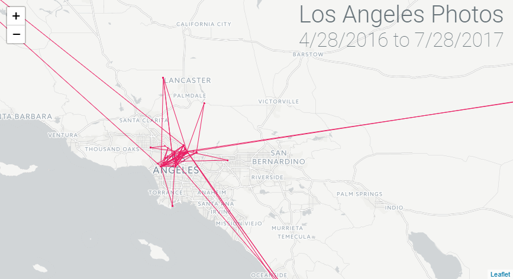

# trip-photo-visualization

Processes EXIF data from a set of images into a thinner JSON blob that can be used to plot the locations on a map! Built to help visualize and document trips.

[Demo Here!](https://gkjohnson.github.io/travel-photo-visualization/example/)



## To Run

Install the npm packages with `npm install`

Add images into `images` folder next to the `index.js` file

Run `node index.js --dest=".../dest.json"` with the arguments described below to generate a JSON file that can be graphed!

## Command Line Arguments
### dest
*Required*
Destination file to output the json to

### min
*Optional*
Javascript parse-able date string that will be used to define the min bound of which images should be considered relevant

### max
*Optional*
Javascript parse-able date string that will be used to define the max bound of which images should be considered relevant

## Output
The output file is an array of json objects that define the image name, date, and lat / lon sorted in date-ascending order.
```
[{
  filename: <original filename>,
  date:     <date string>,
  lat:      <dds array>,
  lon:      <dds array>
},
...]
```

## Plans
- Display image on hover
- Animated trip playback
- Use location hash to accomodate multiple trip files
- Find an appropriate trip to use as an example
