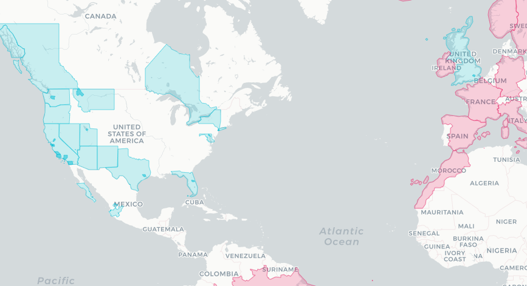

# Travel Map

Map of traveled and hopeful world destinations.

## APIs

### Getting the location paths

APIs found [here](https://gis.stackexchange.com/questions/183248/getting-polygon-boundaries-of-city-in-json-from-google-maps-api).

- Search for the location on https://nominatim.openstreetmap.org/ (ie [Los Angeles](https://nominatim.openstreetmap.org/search.php?q=los+angeles&polygon_geojson=1&viewbox=)).

- Paste the relation id into the url `http://polygons.openstreetmap.fr/get_geojson.py?id=<rel id>&params=0` to load geo json (ie [Los Angeles](http://polygons.openstreetmap.fr/get_geojson.py?id=207359&params=0)) (original search page [here](http://polygons.openstreetmap.fr)).

## TODO
- Add last detail places
- Add hover popup to location name
- Add hover color change
- Add list of places
